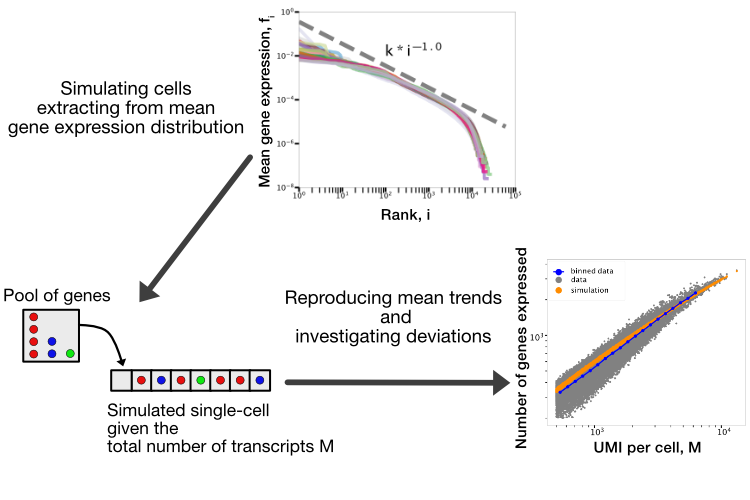

 [](https://doi.org/1101/2021.06.16.448706)



# Emergent statistical laws in single-cell transcriptomic data

Code to reproduce the statistical data analysis of Mouse Cell Atlas and Tabula Muris compendium proposed in the paper "Emergent statistical laws in single-cell transcriptomic data".

# Analyses

## [Tabula Muris](TabulaMuris)
It contains a notebook where is available the code used to analyze the Tabula Muris transcriptomic data.
[Tabula_Muris_Data_Analysis.ipynb](TabulaMuris/Tabula_Muris_Data_Analysis.ipynb)

## [Mouse Cell Atlas](MouseCellAtlas)

In [this folder](MouseCellAtlas) it is possible to reproduce all the analyses involving Mouse Cell Atlas dataset.

Moreover running [combined_analyses.ipynb](MouseCellAtlas/combined_analyses.ipynb) it is possible to reproduce some analyses comparing different datasets as discussed in the paper.

# Additional Tools

## Download the data
Part of the data and results in this repository are stored using Data Version Control [dvc](https://dvc.org) tool.

It is possible to retrieve the data running
```bash
dvc pull -r mydrive
```

## Run in a Docker container
It is possible to run all the notebooks in this repository in a controlled container simply running

```bash
cd docker
docker-compose up -d
```

and then pointing a browser to [localhost](http://localhost:8888)

# Paper
S. Lazzardi, F. Valle, A. Mazzolini, A. Scialdone, M. Caselle and M. Osella, [Emergent statistical laws in single-cell transcriptomic data](), *Frontiers in Genetics*, To Be Announced,(**2021**)

# License
See [LICENSE](LICENSE)

